# 🤖 AgentBlogger: Multi-Agent Content Factory

> **Automate your blog writing with a team of AI agents powered by LangGraph & Ollama.**


**AgentBlogger** is a local-first, privacy-focused application that turns a simple topic into a fully researched, SEO-optimized blog post. It employs a team of three specialized AI agents who collaborate to produce high-quality content.

---

## 🌊 How It Works ( The Flow )

The system uses a **Directed Acyclic Graph (DAG)** to manage the workflow between agents.

```mermaid
graph LR
    User["👤 User Input"] --> Start((Start))
    Start --> Researcher
    
    subgraph "Agent Team"
        Researcher["🕵️ Researcher<br/>(DuckDuckGo)"]
        Writer["✍️ Writer<br/>(Drafts Content)"]
        Critic["🧐 Critic<br/>(Audits & Reviews)"]
    end

    Researcher -- "Research Data" --> Writer
    Writer -- "Draft" --> Critic
    
    Critic -- "Request Changes" --> Writer
    Critic -- "Approve" --> End((Finish))
```



1.  **🕵️ Researcher**: Scours the web using DuckDuckGo to find the latest facts and data on your topic.
2.  **✍️ Writer**: Synthesizes the research into a structured, engaging markdown blog post.
3.  **🧐 Critic**: Reviews the draft for SEO, factual accuracy, and tone. If improvements are needed, it sends the draft back to the Writer (up to 3 times).

---

## ✨ Features

*   **🔒 100% Local Privacy**: Runs entirely on your machine using **Ollama** and local LLMs (default: `deepseek-r1:8b`).
*   **🧠 Intelligent Orchestration**: Powered by **LangGraph** for robust state management and loops.
*   **⚡ Real-Time Research**: Integrated with **DuckDuckGo** for up-to-the-minute information.
*   **👁️ Full Observability**: Tracks every step, trace, and decision via **LangSmith** (optional but recommended).
*   **🎨 Streamlit UI**: A clean, modern interface to interact with your agent team.

---

## 🛠️ Technology Stack

*   **Frontend**: Streamlit
*   **Orchestration**: LangGraph, LangChain
*   **LLM Backend**: Ollama (supports Llama 3, DeepSeek, Mistral, etc.)
*   **Search Engine**: DuckDuckGo Search
*   **Tracing**: LangSmith

---

## 🚀 Quick Start

### Prerequisites
1.  **Python 3.10+** installed.
2.  **[Ollama](https://ollama.com/)** installed and running.
3.  Pull the default model:
    ```bash
    ollama pull deepseek-r1:8b
    ```

### Installation

1.  **Clone the repository**:
    ```bash
    git clone https://github.com/anupamsharnagat/AgentBlogger.git
    cd AgentBlogger
    ```

2.  **Set up the environment**:
    ```bash
    python -m venv .venv
    # Windows
    .venv\Scripts\activate
    # Mac/Linux
    source .venv/bin/activate
    ```

3.  **Install dependencies**:
    ```bash
    pip install streamlit langgraph langchain-ollama duckduckgo-search python-dotenv langchain langchain-community
    ```

4.  **Configure Environment**:
    Create a `.env` file in the root directory:
    ```env
    LANGCHAIN_TRACING_V2=true
    LANGCHAIN_ENDPOINT="https://api.smith.langchain.com"
    LANGCHAIN_API_KEY=your_api_key_here
    LANGCHAIN_PROJECT="Content-Factory-Local"
    ```

5.  **Run the App**:
    ```bash
    streamlit run app.py
    ```

---

## 📸 Usage

1.  Open the app in your browser (usually `http://localhost:8501`).
2.  (Optional) Configure your Ollama URL and Model in the sidebar.
3.  Enter a topic (e.g., *"The Rise of AI Agents in 2025"*).
4.  Click **🚀 Launch Agents**.
5.  Watch the agents work and download your final post!

---

## 🤝 Contributing

Contributions are welcome! Please feel free to submit a Pull Request.
